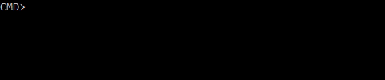

# VoidMain
VoidMain is a framework for building command-line applications. Inspired by ASP.NET Core.
Almost every part of the framework can be extended or replaced.



## This is a work in progress

The framework is still in early development. The API is not final and some features are missing or incomplete. The work on the documentation and performance is not started yet.

**The current state of planned features:**
- Command-line interface
  - Masked/hidden input **(done)**
  - Undo/redo **(done)**
  - Commands history **(done)**
  - Custom prompt message **(done)**
  - Syntax highlighting **(done\*)**
  - Autocomplete
- Standard commands
  - Clear output **(done)**
  - Close application **(done)**
  - Show help **(done)**
  - Show version
- Configuration
  - Method signature **(done)**
  - Attributes **(done)**
  - Expression trees

**\*** *Errors highlighting is not supported yet.*

## How to use it 

**Simple configuration**

```csharp
public class ExampleModule : CommandsModule
{
    public void Hello([Operand] string name)
    {
        Output.WriteLine($"Hello, {name}!");
    }

    [Command(Name = "command name")]
    public void Command(string[] operands, string option, bool flag = false)
    {
        Output.WriteLine("Command was executed.");
    }
}
```

```csharp
class Program : IStartup
{
    static void Main(string[] args)
    {
        CliApp.Run<Program>();
    }

    public void ConfigureServices(IServiceCollection services)
    {
        services.AddConsoleInterface();
        services.AddCommands();
    }

    public void ConfigureApplication(IApplicationBuilder app)
    {
        app.UseHelpCommandsRewriter();
        app.RunCommands(commands =>
        {
            commands.AddStandardCommands();
            commands.AddHelpCommands();
            commands.AddModule<ExampleModule>();
        });
    }
}
```

```
CMD> example hello world
```

You can get rid of the `example` command name part if you configure the `ExcludeFromCommandName` property for the module.
```csharp
[Module(ExcludeFromCommandName = true)]
public class ExampleModule : CommandsModule { }
```
```
CMD> hello world
```

**Advanced configuration**
```csharp
public void ConfigureServices(IServiceCollection services)
{
    services.AddConsoleInterfaceCore()
        .AddPromptMessage("CMD> ")
        .AddUndoRedo(options =>
        {
            options.MaxCount = 10;
            options.SnapshotsComparer = LineViewSnapshotComparer.IgnoreCursor;
        })
        .AddSyntaxHighlighting(options =>
        {
            options.Palette = new CommandLineHighlightingPalette()
            {
                { CommandLineStyleName.CommandName, Color.Yellow },
                { CommandLineStyleName.OptionName, Color.Blue, Color.Yellow },
                { CommandLineStyleName.Operand, new TextStyle(Color.DarkCyan) }
                // OptionNameMarker, OptionValueMarker, OptionValue, EndOfOptions
            };
            // or
            options.Palette = CommandLineHighlightingPalette.Default;
        })
        .AddCommandsHistory(options =>
        {
            options.MaxCount = 10;
            options.SavePeriod = TimeSpan.FromSeconds(10);
            options.CommandsComparer = StringComparer.Ordinal;
        })
        .AddFileStorage(options =>
        {
            options.FilePath = "history.txt";
            options.Encoding = Encoding.UTF8;
        });

    services.AddCommands();
}
```

## Known issues

- **Application closes instead of canceling the current operation after pressing `Ctrl+C` if it was started with `dotnet run`.**<br>This is due to the [issue](https://github.com/dotnet/cli/issues/812) in the .NET CLI. Use `dotnet publish` and run the compiled executable instead.
- **Command line reader is not working on Linux as expected (at all).**<br>Terminal works differently than the Windows console. .NET team tried to make a `Console` API to behave the same way on all platforms with many hacks and compromises, but it is still have differences and bugs. `PowerShell` have some native calls to make it work on Linux. I hope, someday I can make it work too.

## License
MIT License. See [LICENSE](LICENSE) file for more details.